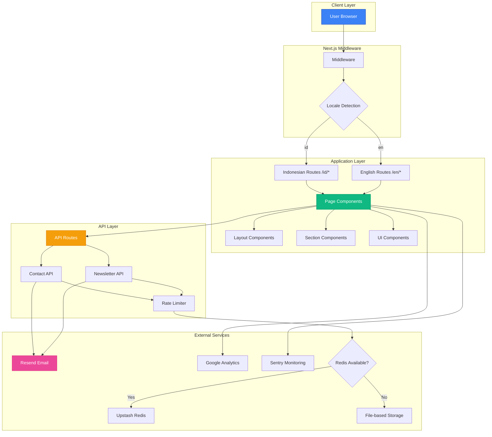
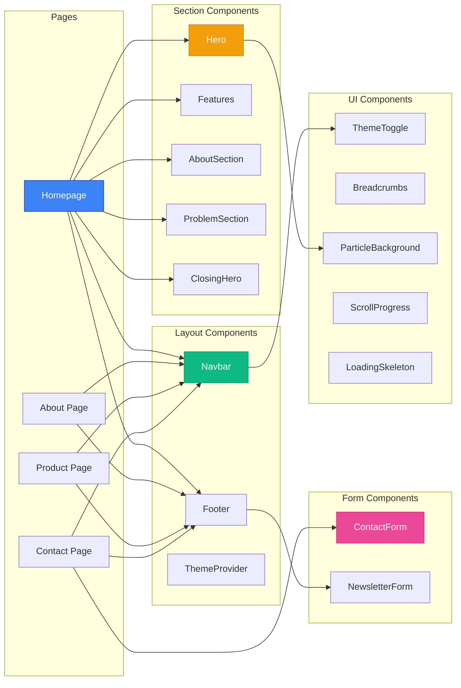
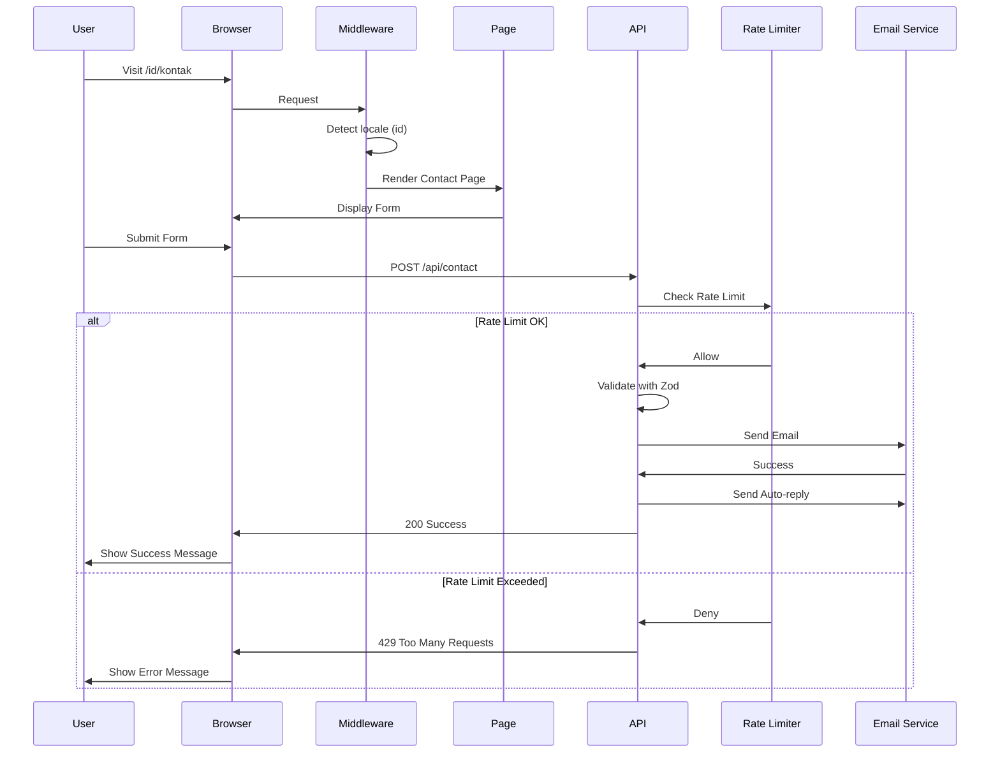

# TemanDifa Web 🌟

> **Aksesibilitas Nyata, Inklusi Tanpa Batas**

Landing page modern untuk TemanDifa - aplikasi AI yang memberdayakan penyandang disabilitas dengan fitur deteksi objek real-time, voice-to-text, scan dokumen, dan emergency call.

[](https://nextjs.org/)
[](https://react.dev/)
[](https://www.typescriptlang.org/)
[](https://tailwindcss.com/)

## 📋 Daftar Isi

- [Fitur Utama](#-fitur-utama)
- [Diagram Arsitektur](#-diagram-arsitektur)
- [Tech Stack](#️-tech-stack)
- [Quick Start](#-quick-start)
- [Struktur Proyek](#-struktur-proyek)
- [Konfigurasi](#-konfigurasi)
- [API Routes](#-api-routes)
- [Testing](#-testing)
- [Deployment](#-deployment)
- [Troubleshooting](#-troubleshooting)
- [Contributing](#-contributing)

## ✨ Fitur Utama

### 🌐 Internationalization
- Support penuh untuk **Bahasa Indonesia** & **English**
- SEO-friendly URL structure (`/id/*`, `/en/*`)
- 150+ translation keys
- Easy to add more languages

### 🌙 Dark Mode
- Seamless theme switching dengan `next-themes`
- System preference detection
- Persistent storage
- Smooth transitions untuk semua komponen

### 🎨 Modern UI/UX
- Responsive design dengan Tailwind CSS 4
- Mobile-first approach
- Glassmorphism effects
- Smooth animations dengan Framer Motion
- Interactive particle backgrounds

### ♿ Accessibility First
- WCAG 2.1 AA Compliant
- ARIA labels & semantic HTML
- Keyboard navigation support
- Screen reader optimized
- Focus indicators
- Skip to content link
- Reduced motion support

### 🚀 Performance
- Next.js 16 App Router
- Image optimization (AVIF/WebP)
- Code splitting & lazy loading
- 1-year cache for static assets
- Font optimization
- Bundle size analysis

### 📊 SEO Optimized
- Comprehensive metadata
- Open Graph & Twitter Cards
- JSON-LD structured data
- Dynamic sitemap & robots.txt
- Canonical URLs
- Multi-language support

### 📝 Advanced Forms
- React Hook Form integration
- Zod schema validation
- Real-time validation
- Honeypot spam protection
- Rate limiting
- Auto-reply emails

### 🐛 Monitoring & Analytics
- Google Analytics (GA4)
- Sentry error tracking
- Web Vitals monitoring
- Performance metrics
- Real-time error alerts

### 🔒 Security
- Rate limiting (Redis + File fallback)
- Security headers (HSTS, CSP, etc.)
- Input sanitization
- XSS protection
- CSRF protection

## 🏗️ Diagram Arsitektur

### System Architecture



### Component Architecture



### Data Flow



## 🛠️ Tech Stack

### Core Technologies

| Category | Technology | Version | Purpose |
|----------|-----------|---------|---------|
| **Framework** | Next.js | 16.0.7 | React framework dengan App Router |
| **UI Library** | React | 19.2.0 | Component-based UI |
| **Language** | TypeScript | 5.0 | Type safety |
| **Styling** | Tailwind CSS | 4.0 | Utility-first CSS |
| **Animation** | Framer Motion | 12.23 | Smooth animations |
| **i18n** | next-intl | 4.5 | Internationalization |
| **Theme** | next-themes | 0.4 | Dark mode support |
| **Forms** | react-hook-form | 7.68 | Form state management |
| **Validation** | Zod | 4.1 | Schema validation |
| **Email** | Resend | 6.5 | Email delivery |
| **Analytics** | Google Analytics | GA4 | Web analytics |
| **Monitoring** | Sentry | 10.30 | Error tracking |
| **Rate Limit** | Upstash Redis | 2.0 | Rate limiting |
| **Testing** | Vitest + Playwright | 4.0 + 1.57 | Unit & E2E tests |

### Development Tools

- **ESLint 9** - Code linting
- **Prettier** - Code formatting
- **@next/bundle-analyzer** - Bundle size analysis
- **TypeScript** - Static type checking
- **PostCSS** - CSS processing

## 🚀 Quick Start

### Prerequisites

```bash
Node.js 18+ or 20+
npm, yarn, or pnpm
```

### Installation

1. **Clone the repository**

   ```bash
   git clone https://github.com/muftiardani/temandifa-landingpage.git
   cd temandifa-web
   ```

2. **Install dependencies**

   ```bash
   npm install
   ```

3. **Setup environment variables**

   ```bash
   cp .env.example .env
   ```

   Edit `.env` dengan konfigurasi Anda:

   ```env
   # Required
   NEXT_PUBLIC_GA_ID=G-XXXXXXXXXX
   RESEND_API_KEY=re_xxxxx
   RESEND_FROM_EMAIL=noreply@temandifa.com
   CONTACT_EMAIL=hello@temandifa.com
   
   # Optional (Production)
   UPSTASH_REDIS_REST_URL=https://xxxxx.upstash.io
   UPSTASH_REDIS_REST_TOKEN=xxxxxxxxxxxxx
   
   # Optional (Monitoring)
   NEXT_PUBLIC_SENTRY_DSN=https://xxxxx@xxxxx.ingest.sentry.io/xxxxx
   SENTRY_ORG=your-org-name
   SENTRY_PROJECT=temandifa-web
   SENTRY_AUTH_TOKEN=xxxxxxxxxxxxx
   ```

4. **Run development server**

   ```bash
   npm run dev
   ```

5. **Open browser**

   Navigate to [http://localhost:3000](http://localhost:3000)

### Build for Production

```bash
# Build
npm run build

# Start production server
npm run start
```

## 📁 Struktur Proyek

```
temandifa-web/
├── app/                          # Next.js App Router
│   ├── [locale]/                 # Locale-based routing
│   │   ├── layout.tsx           # Root layout dengan SEO metadata
│   │   ├── page.tsx             # Homepage
│   │   ├── tentang/             # About page
│   │   │   └── page.tsx
│   │   ├── produk/              # Features page
│   │   │   └── page.tsx
│   │   ├── kontak/              # Contact page
│   │   │   └── page.tsx
│   │   ├── providers/           # Client providers
│   │   │   └── ThemeProvider.tsx
│   │   ├── error.tsx            # Error boundary
│   │   ├── loading.tsx          # Loading state
│   │   └── not-found.tsx        # 404 page
│   ├── api/                     # API routes
│   │   ├── contact/
│   │   │   └── route.ts         # Contact form API
│   │   └── newsletter/
│   │       └── route.ts         # Newsletter API
│   ├── globals.css              # Global styles & animations
│   ├── robots.ts                # SEO robots configuration
│   └── sitemap.ts               # SEO sitemap generation
│
├── components/                   # React components
│   ├── sections/                # Page sections
│   │   ├── Hero.tsx             # Hero section
│   │   ├── Features.tsx         # Features showcase
│   │   ├── AboutSection.tsx     # About section
│   │   ├── ProblemSection.tsx   # Problem statement
│   │   ├── ClosingHero.tsx      # Closing CTA
│   │   └── Features/            # Feature sub-components
│   │       ├── FeatureCard.tsx
│   │       ├── ImageLayer.tsx
│   │       └── PhoneMockup.tsx
│   ├── layout/                  # Layout components
│   │   ├── Navbar.tsx           # Navigation bar
│   │   └── Footer.tsx           # Footer with newsletter
│   ├── forms/                   # Form components
│   │   ├── ContactForm.tsx      # Contact form
│   │   └── NewsletterForm.tsx   # Newsletter subscription
│   ├── ui/                      # Reusable UI components
│   │   ├── ThemeToggle.tsx      # Dark mode toggle
│   │   ├── Breadcrumbs.tsx      # Navigation breadcrumbs
│   │   ├── Counter.tsx          # Animated counter
│   │   ├── LoadingSkeleton.tsx  # Loading skeletons
│   │   ├── PageTransition.tsx   # Page transitions
│   │   ├── ParticleBackground.tsx # Particle effects
│   │   ├── ScrollProgress.tsx   # Scroll indicator
│   │   └── SkipToContent.tsx    # Accessibility skip link
│   └── providers/               # Context providers
│       └── SentryInitializer.tsx # Sentry client init
│
├── i18n/                        # Internationalization
│   └── routing.ts               # i18n routing configuration
│
├── lib/                         # Utility functions & helpers
│   ├── animations.ts            # Framer Motion presets
│   ├── email-templates.ts       # Email HTML templates
│   ├── rate-limit.ts            # File-based rate limiting
│   ├── redis-rate-limit.ts      # Redis rate limiting
│   └── web-vitals.ts            # Performance tracking
│
├── messages/                    # Translation files
│   ├── id.json                  # Indonesian translations
│   └── en.json                  # English translations
│
├── public/                      # Static assets
│   └── images/                  # Images & mockups
│       ├── logo.png
│       ├── woman-man.png
│       ├── menu-mockup.png
│       ├── camera-mockup.png
│       ├── mic-mockup.png
│       └── video-mockup.png
│
├── tests/                       # Test files
│   ├── components/              # Component tests
│   ├── integration/             # Integration tests
│   ├── unit/                    # Unit tests
│   └── e2e/                     # E2E tests
│
├── .env                         # Environment variables (gitignored)
├── .env.example                 # Environment template
├── middleware.ts                # Next.js middleware (i18n)
├── next.config.ts               # Next.js configuration
├── tailwind.config.ts           # Tailwind CSS configuration
├── tsconfig.json                # TypeScript configuration
├── vitest.config.ts             # Vitest configuration
├── playwright.config.ts         # Playwright configuration
├── eslint.config.mjs            # ESLint configuration
├── .prettierrc.js               # Prettier configuration
└── package.json                 # Dependencies & scripts
```

## ⚙️ Konfigurasi

### Tailwind CSS Custom Configuration

```typescript
// tailwind.config.ts
{
  darkMode: "selector",
  theme: {
    extend: {
      fontFamily: {
        poppins: ["var(--font-poppins)", "sans-serif"],
      },
      spacing: {
        "70": "17.5rem",   // 280px
        "75": "18.75rem",  // 300px
        "80": "20rem",     // 320px
        "95": "23.75rem",  // 380px
        "105": "26.25rem", // 420px
        "160": "40rem"     // 640px
      },
      borderWidth: {
        "50": "50px",
        "60": "60px",
      },
      zIndex: {
        "12": "12",
      },
    },
  },
}
```

### Next.js Configuration Highlights

```typescript
// next.config.ts
{
  images: {
    formats: ["image/avif", "image/webp"],
    minimumCacheTTL: 31536000, // 1 year
  },
  compress: true,
  poweredByHeader: false,
  // Security headers, Sentry, Bundle analyzer
}
```

### TypeScript Configuration

```json
{
  "compilerOptions": {
    "strict": true,
    "target": "ES2017",
    "paths": {
      "@/*": ["./*"]
    }
  }
}
```

### Internationalization Setup

```typescript
// i18n/routing.ts
export const routing = defineRouting({
  locales: ["en", "id"],
  defaultLocale: "id",
});
```

### Dark Mode Setup

```tsx
// app/[locale]/providers/ThemeProvider.tsx
<ThemeProvider
  attribute="class"
  defaultTheme="system"
  enableSystem
  disableTransitionOnChange
>
  {children}
</ThemeProvider>
```

### Animation Presets

```typescript
// lib/animations.ts
export const fadeInUp = {
  initial: { opacity: 0, y: 60 },
  animate: { opacity: 1, y: 0 },
  transition: { duration: 0.6, ease: "easeOut" },
};

export const fadeIn = {
  initial: { opacity: 0 },
  animate: { opacity: 1 },
  transition: { duration: 0.8, ease: "easeOut" },
};
```

## 🔌 API Routes

### Contact Form API

**Endpoint:** `POST /api/contact`

**Features:**
- ✅ Zod schema validation
- ✅ Rate limiting (3 requests/60s per IP)
- ✅ Honeypot spam protection
- ✅ Email via Resend
- ✅ Auto-reply to sender
- ✅ Request ID tracking
- ✅ Detailed error logging

**Request Body:**
```json
{
  "name": "John Doe",
  "email": "john@example.com",
  "subject": "Question about TemanDifa",
  "message": "Your message here..."
}
```

**Response (Success):**
```json
{
  "success": true,
  "message": "Email sent successfully",
  "requestId": "uuid-here",
  "id": "resend-email-id"
}
```

**Response (Rate Limited):**
```json
{
  "error": "Too many requests. Please try again later.",
  "retryAfter": 45
}
```

**Response Headers:**
```
X-RateLimit-Limit: 3
X-RateLimit-Remaining: 2
X-RateLimit-Reset: 1702345678000
```

### Newsletter API

**Endpoint:** `POST /api/newsletter`

**Features:**
- ✅ Email validation
- ✅ Rate limiting (3 requests/60s per IP)
- ✅ Honeypot protection
- ✅ Welcome email automation
- ✅ Duplicate prevention

**Request Body:**
```json
{
  "email": "user@example.com"
}
```

**Response (Success):**
```json
{
  "success": true,
  "message": "Subscription successful"
}
```

## 🧪 Testing

### Available Scripts

```bash
# Unit & Integration Tests (Vitest)
npm run test              # Run tests
npm run test:ui           # Run with UI
npm run test:coverage     # Generate coverage report
npm run test:watch        # Watch mode

# E2E Tests (Playwright)
npm run test:e2e          # Run E2E tests
npm run test:e2e:ui       # Run with UI
npm run test:e2e:headed   # Headed mode (see browser)
npm run test:e2e:debug    # Debug mode

# Run All Tests
npm run test:all          # Unit + E2E tests
```

### Unit Tests (Vitest)

**Configuration:**
- Framework: Vitest 4.0.15
- Environment: jsdom
- Coverage: v8 provider
- Testing Library: @testing-library/react

**Example Test:**
```typescript
import { render, screen } from '@testing-library/react';
import { describe, it, expect } from 'vitest';
import Hero from '@/components/sections/Hero';

describe('Hero Component', () => {
  it('renders hero section', () => {
    render(<Hero />);
    expect(screen.getByRole('heading')).toBeInTheDocument();
  });
});
```

### E2E Tests (Playwright)

**Configuration:**
- Framework: Playwright 1.57.0
- Browsers: Chrome, Firefox, Safari, Mobile Chrome, Mobile Safari

**Example Test:**
```typescript
import { test, expect } from '@playwright/test';

test('homepage loads correctly', async ({ page }) => {
  await page.goto('/');
  await expect(page.locator('h1')).toBeVisible();
});
```

## 📝 Available Scripts

### Development

```bash
npm run dev          # Start development server (localhost:3000)
```

### Production

```bash
npm run build        # Build for production
npm run start        # Start production server
```

### Code Quality

```bash
npm run lint         # Run ESLint
npm run format       # Format code with Prettier
npm run format:check # Check code formatting
```

### Testing

```bash
npm run test              # Run unit tests
npm run test:ui           # Run tests with UI
npm run test:coverage     # Generate coverage report
npm run test:watch        # Run tests in watch mode
npm run test:e2e          # Run E2E tests
npm run test:e2e:ui       # Run E2E tests with UI
npm run test:e2e:headed   # Run E2E tests in headed mode
npm run test:e2e:debug    # Debug E2E tests
npm run test:all          # Run all tests
```

### Analysis

```bash
npm run analyze      # Analyze bundle size
```

## 🚀 Deployment

### Vercel (Recommended)

1. **Push to GitHub**
   ```bash
   git push origin main
   ```

2. **Import to Vercel**
   - Go to [vercel.com](https://vercel.com)
   - Import your repository
   - Configure environment variables
   - Deploy

3. **Environment Variables**
   Add these in Vercel dashboard:
   ```
   NEXT_PUBLIC_GA_ID
   RESEND_API_KEY
   RESEND_FROM_EMAIL
   CONTACT_EMAIL
   UPSTASH_REDIS_REST_URL
   UPSTASH_REDIS_REST_TOKEN
   NEXT_PUBLIC_SENTRY_DSN
   SENTRY_ORG
   SENTRY_PROJECT
   SENTRY_AUTH_TOKEN
   ```

### Other Platforms

#### Netlify
```bash
npm run build
# Deploy .next folder
```

#### Docker
```dockerfile
FROM node:20-alpine
WORKDIR /app
COPY package*.json ./
RUN npm ci
COPY . .
RUN npm run build
EXPOSE 3000
CMD ["npm", "start"]
```

### Pre-deployment Checklist

- [ ] Update environment variables
- [ ] Test production build locally
- [ ] Run all tests
- [ ] Check bundle size
- [ ] Verify SEO metadata
- [ ] Test on multiple devices
- [ ] Check accessibility
- [ ] Configure domain & SSL
- [ ] Setup monitoring (Sentry)
- [ ] Configure analytics (GA4)

## 🛡️ Security Features

### Rate Limiting

**Dual Strategy:**
1. **Redis-based (Production)**
   - Upstash Redis
   - Sliding window algorithm
   - 3 requests per 60 seconds

2. **File-based (Development)**
   - JSON file storage
   - Automatic fallback
   - Same limits as Redis

### Spam Protection

- Honeypot fields in forms
- Email validation with Zod
- IP-based rate limiting
- Input sanitization

### Security Headers

```typescript
Strict-Transport-Security: max-age=63072000; includeSubDomains; preload
X-Frame-Options: DENY
X-Content-Type-Options: nosniff
Referrer-Policy: origin-when-cross-origin
Permissions-Policy: camera=(), microphone=(), geolocation=()
```

## 📊 Monitoring & Analytics

### Google Analytics (GA4)

Track page views, user interactions, and conversions.

```env
NEXT_PUBLIC_GA_ID=G-XXXXXXXXXX
```

**Tracked Events:**
- Page views
- Button clicks
- Form submissions
- Newsletter subscriptions
- Language changes
- Theme toggles

### Sentry Error Tracking

Real-time error monitoring and performance tracking.

```env
NEXT_PUBLIC_SENTRY_DSN=https://xxxxx@xxxxx.ingest.sentry.io/xxxxx
SENTRY_ORG=your-org-name
SENTRY_PROJECT=temandifa-web
```

**Features:**
- Error tracking
- Performance monitoring
- Source maps upload
- React component annotations
- Breadcrumbs
- Session replay

### Web Vitals

Automatic tracking of Core Web Vitals:
- **CLS** - Cumulative Layout Shift
- **FID** - First Input Delay
- **FCP** - First Contentful Paint
- **LCP** - Largest Contentful Paint
- **TTFB** - Time to First Byte
- **INP** - Interaction to Next Paint

## 🔧 Troubleshooting

### Common Issues

#### 1. Build Errors

**Problem:** `Module not found` errors

**Solution:**
```bash
# Clear cache and reinstall
rm -rf .next node_modules
npm install
npm run build
```

#### 2. Environment Variables Not Working

**Problem:** Environment variables undefined

**Solution:**
- Ensure `.env` file exists
- Restart dev server after changes
- Check variable names (must start with `NEXT_PUBLIC_` for client-side)

#### 3. Dark Mode Not Working

**Problem:** Theme not persisting

**Solution:**
```typescript
// Check ThemeProvider is wrapping your app
// Ensure suppressHydrationWarning on <html>
<html lang={locale} suppressHydrationWarning>
```

#### 4. Rate Limiting Issues

**Problem:** Rate limit not working

**Solution:**
- Check Redis connection (production)
- Verify `tmp` folder exists (development)
- Check IP detection in headers

#### 5. Email Not Sending

**Problem:** Contact form emails not delivered

**Solution:**
- Verify `RESEND_API_KEY` is correct
- Check sender email is verified in Resend
- Review Resend dashboard for errors
- Check spam folder

#### 6. i18n Issues

**Problem:** Translations not loading

**Solution:**
- Verify JSON files in `/messages`
- Check locale in URL (`/id` or `/en`)
- Restart dev server

### Debug Mode

Enable debug logging:

```bash
# Development
DEBUG=* npm run dev

# Specific modules
DEBUG=next:* npm run dev
```

## 🤝 Contributing

We welcome contributions! Please follow these guidelines:

### Getting Started

1. **Fork the repository**
2. **Clone your fork**
   ```bash
   git clone https://github.com/your-username/temandifa-web.git
   ```
3. **Create a branch**
   ```bash
   git checkout -b feature/your-feature-name
   ```

### Development Workflow

1. **Make your changes**
2. **Run tests**
   ```bash
   npm run test
   npm run test:e2e
   ```
3. **Check code quality**
   ```bash
   npm run lint
   npm run format
   ```
4. **Commit your changes**
   ```bash
   git commit -m "feat: add new feature"
   ```
5. **Push to your fork**
   ```bash
   git push origin feature/your-feature-name
   ```
6. **Create a Pull Request**

### Commit Convention

We use [Conventional Commits](https://www.conventionalcommits.org/):

```
feat: add new feature
fix: fix bug
docs: update documentation
style: format code
refactor: refactor code
test: add tests
chore: update dependencies
```

### Code Style

- Use TypeScript
- Follow ESLint rules
- Format with Prettier
- Write meaningful commit messages
- Add tests for new features
- Update documentation

### Pull Request Guidelines

- Keep PRs focused and small
- Update tests if needed
- Update documentation
- Ensure all tests pass
- Follow code style guidelines

## 🔐 Environment Variables

### Required Variables

```env
# Google Analytics
NEXT_PUBLIC_GA_ID=G-XXXXXXXXXX

# Email Service (Resend)
RESEND_API_KEY=re_xxxxx
RESEND_FROM_EMAIL=noreply@temandifa.com
CONTACT_EMAIL=hello@temandifa.com
```

### Optional Variables (Production Recommended)

```env
# Upstash Redis (Rate Limiting)
UPSTASH_REDIS_REST_URL=https://xxxxx.upstash.io
UPSTASH_REDIS_REST_TOKEN=xxxxxxxxxxxxx

# Sentry (Error Tracking)
NEXT_PUBLIC_SENTRY_DSN=https://xxxxx@xxxxx.ingest.sentry.io/xxxxx
SENTRY_ORG=your-org-name
SENTRY_PROJECT=temandifa-web
SENTRY_AUTH_TOKEN=xxxxxxxxxxxxx
```

### Getting API Keys

| Service | URL | Free Tier |
|---------|-----|-----------|
| **Google Analytics** | [analytics.google.com](https://analytics.google.com/) | Unlimited |
| **Resend** | [resend.com](https://resend.com/api-keys) | 100 emails/day |
| **Upstash Redis** | [console.upstash.com](https://console.upstash.com) | 10,000 commands/day |
| **Sentry** | [sentry.io](https://sentry.io/) | 5,000 errors/month |

## 🌟 Key Features Implementation

### Keyboard Accessibility

- **ESC key** - Closes mobile menu
- **Tab navigation** - All interactive elements
- **Enter/Space** - Activate buttons
- **Arrow keys** - Navigate menus
- **Focus indicators** - Visible focus states

### Performance Optimization

- Next.js Image component with priority loading
- AVIF & WebP image formats
- 1-year cache for static assets
- Compression enabled
- Code splitting & lazy loading
- Font optimization with variable fonts
- Minimal JavaScript bundle

### SEO Features

- Comprehensive metadata
- Open Graph tags
- Twitter Card support
- JSON-LD structured data (Organization, Website, MobileApp)
- Dynamic sitemap & robots.txt
- Canonical URLs
- Multi-language support
- Semantic HTML structure

## 📚 Additional Resources

### Documentation

- [Next.js Documentation](https://nextjs.org/docs)
- [React Documentation](https://react.dev)
- [Tailwind CSS Documentation](https://tailwindcss.com/docs)
- [Framer Motion Documentation](https://www.framer.com/motion/)
- [next-intl Documentation](https://next-intl-docs.vercel.app/)

### Tutorials

- [Next.js App Router Tutorial](https://nextjs.org/learn)
- [TypeScript Handbook](https://www.typescriptlang.org/docs/handbook/intro.html)
- [Accessibility Guidelines](https://www.w3.org/WAI/WCAG21/quickref/)

## 📄 License

This project is private and proprietary to TemanDifa.

## 🔗 Links

- **Website:** [https://temandifa.com](https://temandifa.com)
- **Instagram:** [@temandifa](https://instagram.com/temandifa)
- **TikTok:** [@temandifa](https://tiktok.com/@temandifa)
- **LinkedIn:** [temandifa-com](https://linkedin.com/company/temandifa-com)
- **Email:** hello@temandifa.com

## 🙏 Acknowledgments

- Next.js team for the amazing framework
- Vercel for hosting and deployment
- All open-source contributors
- TemanDifa team for the vision

---

**Made with ❤️ by TemanDifa Team**

*Empowering accessibility through technology*
