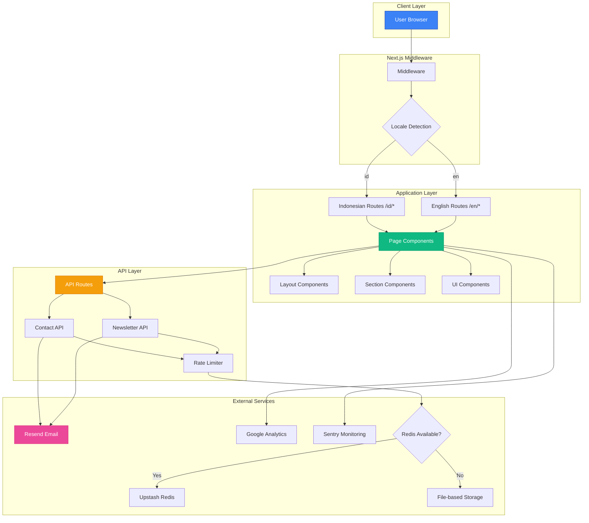
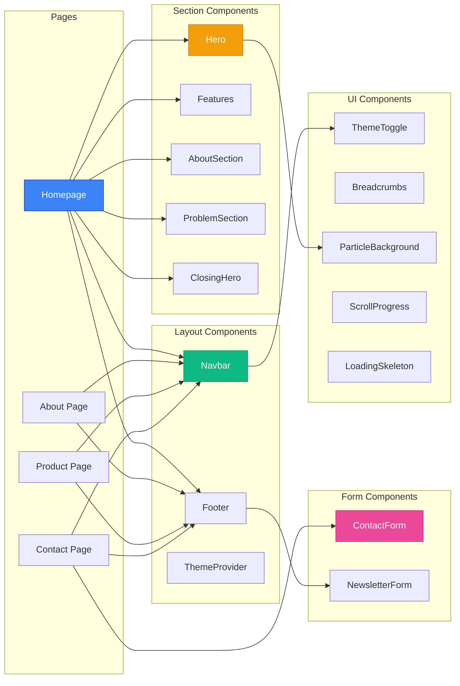
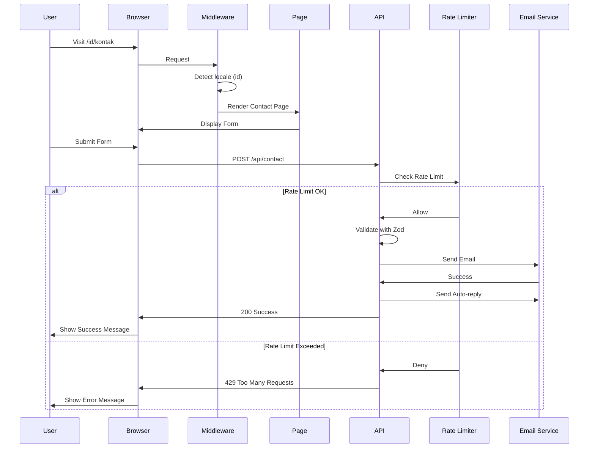

# TemanDifa Web 🌟

> **Aksesibilitas Nyata, Inklusi Tanpa Batas**

Landing page modern untuk TemanDifa - aplikasi AI yang memberdayakan penyandang disabilitas dengan fitur deteksi objek real-time, voice-to-text, scan dokumen, dan emergency call.

[](https://nextjs.org/)
[](https://react.dev/)
[](https://www.typescriptlang.org/)
[](https://tailwindcss.com/)

## 📋 Daftar Isi

- [Fitur Utama](#-fitur-utama)
- [Diagram Arsitektur](#-diagram-arsitektur)
- [Tech Stack](#️-tech-stack)
- [Quick Start](#-quick-start)
- [Struktur Proyek](#-struktur-proyek)
- [Konfigurasi](#-konfigurasi)
- [API Routes](#-api-routes)

## ✨ Fitur Utama

### 🌐 Internationalization

- Support penuh untuk **Bahasa Indonesia** & **English**
- SEO-friendly URL structure (`/id/*`, `/en/*`)
- 150+ translation keys
- Easy to add more languages

### 🌙 Dark Mode

- Seamless theme switching dengan `next-themes`
- System preference detection
- Persistent storage
- Smooth transitions untuk semua komponen

### 🎨 Modern UI/UX

- Responsive design dengan Tailwind CSS 4
- Mobile-first approach
- Glassmorphism effects
- Smooth animations dengan Framer Motion
- Interactive particle backgrounds

### ♿ Accessibility First

- WCAG 2.1 AA Compliant
- ARIA labels & semantic HTML
- Keyboard navigation support
- Screen reader optimized
- Focus indicators
- Skip to content link
- Reduced motion support

### 🚀 Performance

- Next.js 16 App Router
- Image optimization (AVIF/WebP)
- Code splitting & lazy loading
- 1-year cache for static assets
- Font optimization
- Bundle size analysis

### 📊 SEO Optimized

- Comprehensive metadata
- Open Graph & Twitter Cards
- JSON-LD structured data
- Dynamic sitemap & robots.txt
- Canonical URLs
- Multi-language support

### 📝 Advanced Forms

- React Hook Form integration
- Zod schema validation
- Real-time validation
- Honeypot spam protection
- Rate limiting
- Auto-reply emails

### 🐛 Monitoring & Analytics

- **Google Analytics (GA4)** - Web analytics
- **Sentry error tracking** - Production-optimized
  - Environment-aware sampling (10% in production)
  - Session replay (100% errors, 10% sessions)
  - Debug mode (development only)
  - Performance monitoring
- **Web Vitals monitoring** - LCP, FID, CLS, FCP, TTFB, INP
- **Logger Service** - Centralized logging
  - Environment-aware (dev vs production)
  - Auto-integration with Sentry
  - Context tagging
  - Performance measurement

### 📝 Logger Service

- **Environment-aware logging** - Different behavior for dev/production
- **Multiple log levels** - debug, info, warn, error, success
- **Sentry integration** - Auto-sends errors to Sentry
- **Context tagging** - Organize logs by feature
- **Performance utilities** - time(), timeEnd(), group()
- **Production-ready** - No debug noise in production

### 🔒 Security

- **CSRF Protection** - Token-based validation
- **Content Security Policy** - XSS prevention
- **Rate limiting** - Redis + File fallback
- **Security headers** - HSTS, CSP, X-Frame-Options
- **Input sanitization** - HTML escaping
- **XSS protection** - Content filtering
- **Environment validation** - Runtime checks

## 🏗️ Diagram Arsitektur

### System Architecture



### Component Architecture



### Data Flow



## 🛠️ Tech Stack

### Core Technologies

| Category       | Technology          | Version    | Purpose                           |
| -------------- | ------------------- | ---------- | --------------------------------- |
| **Framework**  | Next.js             | 16.0.7     | React framework dengan App Router |
| **UI Library** | React               | 19.2.0     | Component-based UI                |
| **Language**   | TypeScript          | 5.0        | Type safety                       |
| **Styling**    | Tailwind CSS        | 4.0        | Utility-first CSS                 |
| **Animation**  | Framer Motion       | 12.23      | Smooth animations                 |
| **i18n**       | next-intl           | 4.5        | Internationalization              |
| **Theme**      | next-themes         | 0.4        | Dark mode support                 |
| **Forms**      | react-hook-form     | 7.68       | Form state management             |
| **Validation** | Zod                 | 4.1        | Schema validation                 |
| **Email**      | Resend              | 6.5        | Email delivery                    |
| **Analytics**  | Google Analytics    | GA4        | Web analytics                     |
| **Monitoring** | Sentry              | 10.30      | Error tracking                    |
| **Rate Limit** | Upstash Redis       | 2.0        | Rate limiting                     |
| **Testing**    | Vitest + Playwright | 4.0 + 1.57 | Unit & E2E tests                  |

### Development Tools

- **ESLint 9** - Code linting
- **Prettier** - Code formatting
- **@next/bundle-analyzer** - Bundle size analysis
- **TypeScript** - Static type checking
- **PostCSS** - CSS processing

## 🚀 Quick Start

### Prerequisites

```bash
Node.js 18+ or 20+
npm, yarn, or pnpm
```

### Installation

1. **Clone the repository**

   ```bash
   git clone https://github.com/muftiardani/temandifa-landingpage.git
   cd temandifa-web
   ```

2. **Install dependencies**

   ```bash
   npm install
   ```

3. **Setup environment variables**

   ```bash
   cp .env.example .env
   ```

   Edit `.env` dengan konfigurasi Anda

4. **Run development server**

   ```bash
   npm run dev
   ```

5. **Open browser**

   Navigate to [http://localhost:3000](http://localhost:3000)

### Build for Production

```bash
# Build
npm run build

# Start production server
npm run start
```

## 📁 Struktur Proyek

```
temandifa-web/
├── app/                          # Next.js App Router
│   ├── [locale]/                 # Locale-based routing
│   │   ├── layout.tsx           # Root layout dengan SEO metadata
│   │   ├── page.tsx             # Homepage
│   │   ├── tentang/             # About page
│   │   │   └── page.tsx
│   │   ├── produk/              # Features page
│   │   │   └── page.tsx
│   │   ├── kontak/              # Contact page
│   │   │   └── page.tsx
│   │   ├── providers/           # Client providers
│   │   │   └── ThemeProvider.tsx
│   │   ├── error.tsx            # Error boundary
│   │   ├── loading.tsx          # Loading state
│   │   └── not-found.tsx        # 404 page
│   ├── api/                     # API routes
│   │   ├── csrf/                # CSRF token endpoint
│   │   │   └── route.ts
│   │   ├── contact/
│   │   │   └── route.ts         # Contact form API
│   │   └── newsletter/
│   │       └── route.ts         # Newsletter API
│   ├── globals.css              # Global styles & animations
│   ├── robots.ts                # SEO robots configuration
│   └── sitemap.ts               # SEO sitemap generation
│
├── components/                   # React components
│   ├── sections/                # Page sections
│   │   ├── Hero.tsx             # Hero section
│   │   ├── Features.tsx         # Features showcase
│   │   ├── AboutSection.tsx     # About section
│   │   ├── ProblemSection.tsx   # Problem statement
│   │   ├── ClosingHero.tsx      # Closing CTA
│   │   └── Features/            # Feature sub-components
│   │       ├── FeatureCard.tsx
│   │       ├── ImageLayer.tsx
│   │       └── PhoneMockup.tsx
│   ├── layout/                  # Layout components
│   │   ├── Navbar.tsx           # Navigation bar
│   │   └── Footer.tsx           # Footer with newsletter
│   ├── forms/                   # Form components
│   │   ├── ContactForm.tsx      # Contact form with CSRF
│   │   └── NewsletterForm.tsx   # Newsletter subscription
│   ├── ui/                      # Reusable UI components
│   │   ├── ThemeToggle.tsx      # Dark mode toggle
│   │   ├── Breadcrumbs.tsx      # Navigation breadcrumbs
│   │   ├── Counter.tsx          # Animated counter
│   │   ├── ErrorBoundary.tsx    # Error boundary
│   │   ├── LoadingSkeleton.tsx  # Loading skeletons
│   │   ├── PageTransition.tsx   # Page transitions
│   │   ├── ParticleBackground.tsx # Particle effects
│   │   ├── ScrollProgress.tsx   # Scroll indicator
│   │   └── SkipToContent.tsx    # Accessibility skip link
│   └── providers/               # Context providers
│       └── SentryInitializer.tsx # Sentry client init
│
├── types/                       # TypeScript type definitions
│   ├── forms.ts                 # Form types
│   ├── api.ts                   # API response types
│   ├── components.ts            # Component prop types
│   └── index.ts                 # Centralized exports
│
├── constants/                   # Application constants
│   ├── routes.ts                # Route definitions
│   ├── rate-limits.ts           # Rate limit configurations
│   ├── i18n.ts                  # i18n constants
│   └── index.ts                 # Centralized exports
│
├── hooks/                       # Custom React hooks
│   ├── useMediaQuery.ts         # Media query detection
│   ├── useScrollPosition.ts     # Scroll position tracking
│   ├── useLocalStorage.ts       # LocalStorage sync
│   ├── useDebounce.ts           # Value debouncing
│   └── index.ts                 # Centralized exports
│
├── utils/                       # Pure utility functions
│   ├── date.ts                  # Date formatting
│   ├── string.ts                # String manipulation
│   ├── number.ts                # Number formatting
│   └── index.ts                 # Centralized exports
│
├── styles/                      # Styling utilities
│   └── animations.ts            # Framer Motion presets
│
├── i18n/                        # Internationalization
│   └── routing.ts               # i18n routing configuration
│
├── lib/                         # Utility functions & helpers
│   ├── security/                # Security utilities
│   │   ├── csrf.ts              # CSRF protection
│   │   ├── rate-limit.ts        # File-based rate limiting
│   │   └── redis-rate-limit.ts  # Redis rate limiting
│   ├── email/                   # Email utilities
│   │   └── templates.ts         # Email HTML templates
│   ├── validation/              # Validation utilities
│   │   └── schemas.ts           # Zod schemas
│   ├── analytics/               # Analytics utilities
│   │   └── web-vitals.ts        # Performance tracking
│   ├── seo/                     # SEO utilities
│   │   ├── structured-data.ts   # JSON-LD generation
│   │   └── image-placeholders.ts # Blur placeholders
│   ├── logger.ts                # Logger service
│   ├── config.ts                # App configuration
│   └── env.ts                   # Environment validation
│
├── messages/                    # Translation files
│   ├── id.json                  # Indonesian translations
│   └── en.json                  # English translations
│
├── public/                      # Static assets
│   └── images/                  # Images & mockups
│       ├── logo.png
│       ├── woman-man.png
│       ├── menu-mockup.png
│       ├── camera-mockup.png
│       ├── mic-mockup.png
│       └── video-mockup.png
│
├── tests/                       # Test files
│   ├── components/              # Component tests
│   ├── integration/             # Integration tests
│   ├── unit/                    # Unit tests
│   └── e2e/                     # E2E tests
│
├── .env                         # Environment variables (gitignored)
├── .env.example                 # Environment template
├── middleware.ts                # Next.js middleware (i18n)
├── next.config.ts               # Next.js configuration
├── sentry.client.config.js      # Sentry client configuration
├── sentry.server.config.js      # Sentry server configuration
├── sentry.edge.config.js        # Sentry edge configuration
├── tailwind.config.ts           # Tailwind CSS configuration
├── tsconfig.json                # TypeScript configuration
├── vitest.config.ts             # Vitest configuration
├── playwright.config.ts         # Playwright configuration
├── eslint.config.mjs            # ESLint configuration
├── .prettierrc.js               # Prettier configuration
└── package.json                 # Dependencies & scripts
```

## 🔌 API Routes

### Contact Form API

**Endpoint:** `POST /api/contact`

**Features:**

- ✅ Zod schema validation
- ✅ CSRF protection
- ✅ Rate limiting (3 requests/60s per IP)
- ✅ Honeypot spam protection
- ✅ Email via Resend
- ✅ Auto-reply to sender
- ✅ Request ID tracking
- ✅ Detailed error logging

**Request Body:**

```json
{
  "name": "John Doe",
  "email": "john@example.com",
  "subject": "Question about TemanDifa",
  "message": "Your message here..."
}
```

**Response (Success):**

```json
{
  "success": true,
  "message": "Email sent successfully",
  "requestId": "uuid-here",
  "id": "resend-email-id"
}
```

**Response (Rate Limited):**

```json
{
  "error": "Too many requests. Please try again later.",
  "retryAfter": 45
}
```

**Response Headers:**

```
X-RateLimit-Limit: 3
X-RateLimit-Remaining: 2
X-RateLimit-Reset: 1702345678000
```

### Newsletter API

**Endpoint:** `POST /api/newsletter`

**Features:**

- ✅ Email validation
- ✅ CSRF protection
- ✅ Rate limiting (3 requests/60s per IP)
- ✅ Honeypot protection
- ✅ Welcome email automation
- ✅ Duplicate prevention

**Request Body:**

```json
{
  "email": "user@example.com"
}
```

**Response (Success):**

```json
{
  "success": true,
  "message": "Subscription successful"
}
```

## 📝 Available Scripts

### Development

```bash
npm run dev          # Start development server (localhost:3000)
```

### Production

```bash
npm run build        # Build for production
npm run start        # Start production server
```

### Code Quality

```bash
npm run lint         # Run ESLint
npm run format       # Format code with Prettier
npm run format:check # Check code formatting
```

### Testing

```bash
npm run test              # Run unit tests
npm run test:ui           # Run tests with UI
npm run test:coverage     # Generate coverage report
npm run test:watch        # Run tests in watch mode
npm run test:e2e          # Run E2E tests
npm run test:e2e:ui       # Run E2E tests with UI
npm run test:e2e:headed   # Run E2E tests in headed mode
npm run test:e2e:debug    # Debug E2E tests
npm run test:all          # Run all tests
```

### Analysis

```bash
npm run analyze      # Analyze bundle size
```

## 📄 License

This project is private and proprietary to TemanDifa.

## 🔗 Links

- **Website:** [https://temandifa.com](https://temandifa.com)
- **Instagram:** [@temandifa](https://instagram.com/temandifa)
- **TikTok:** [@temandifa](https://tiktok.com/@temandifa)
- **LinkedIn:** [temandifa-com](https://linkedin.com/company/temandifa-com)
- **Email:** hello@temandifa.com

---

**Made with ❤️ by TemanDifa Team**

_Empowering accessibility through technology_
