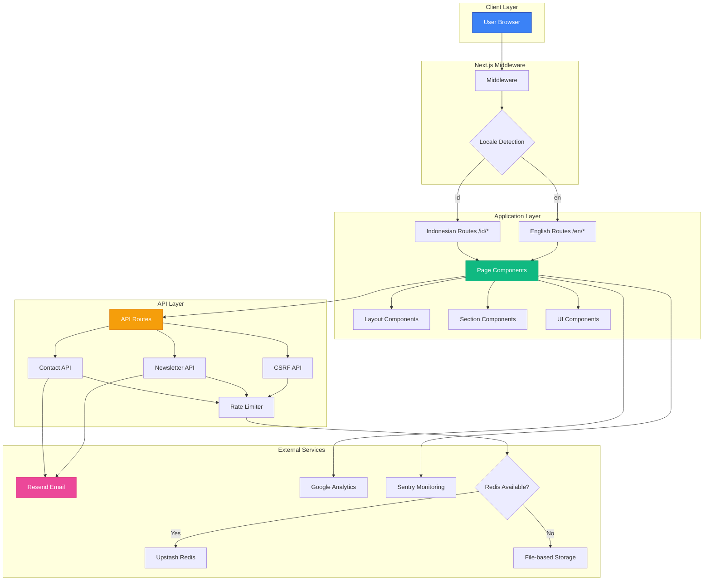
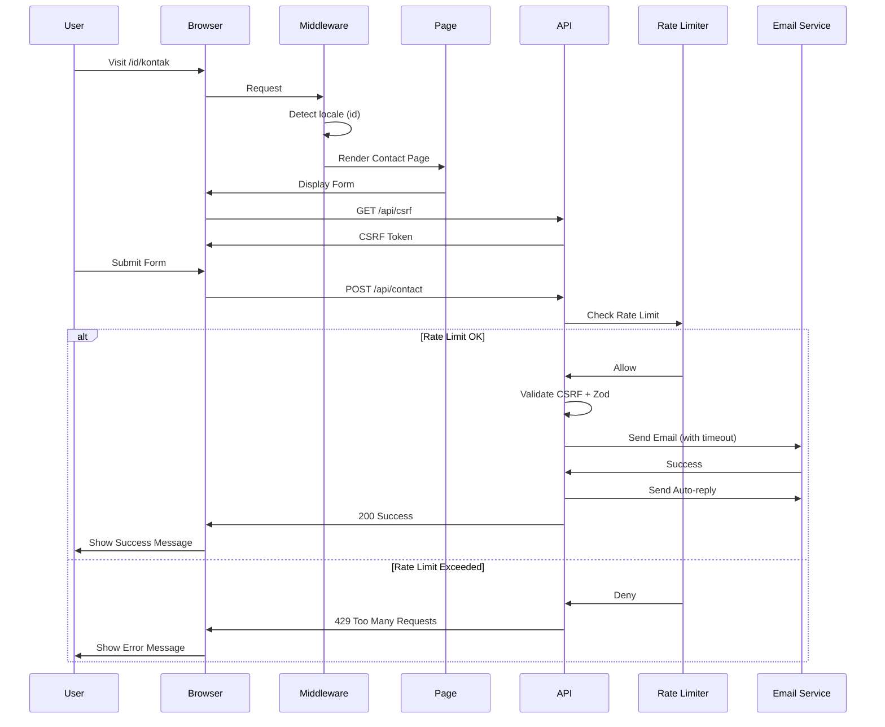

# TemanDifa Web 🌟

> **Aksesibilitas Nyata, Inklusi Tanpa Batas**

Landing page modern untuk TemanDifa - aplikasi AI yang memberdayakan penyandang disabilitas dengan fitur deteksi objek real-time, voice-to-text, scan dokumen, dan emergency call.

[](https://nextjs.org/)
[](https://react.dev/)
[](https://www.typescriptlang.org/)
[](https://tailwindcss.com/)
[](./tests)

## 📋 Daftar Isi

- [Fitur Utama](#-fitur-utama)
- [Diagram Arsitektur](#-diagram-arsitektur)
- [Tech Stack](#️-tech-stack)
- [Quick Start](#-quick-start)
- [Struktur Proyek](#-struktur-proyek)
- [Environment Variables](#-environment-variables)
- [API Routes](#-api-routes)
- [Testing](#-testing)
- [Scripts](#-available-scripts)

## ✨ Fitur Utama

### 🌐 Internationalization

- Support penuh untuk **Bahasa Indonesia** & **English**
- SEO-friendly URL structure (`/id/*`, `/en/*`)
- 150+ translation keys
- Dynamic locale detection

### 🌙 Dark Mode

- Seamless theme switching dengan `next-themes`
- System preference detection
- Persistent storage
- Smooth transitions

### 🎨 Modern UI/UX

- Responsive design dengan Tailwind CSS 4
- Mobile-first approach
- Glassmorphism effects
- Smooth animations dengan Framer Motion
- Interactive particle backgrounds

### ♿ Accessibility First

- WCAG 2.1 AA Compliant
- ARIA labels & semantic HTML
- Keyboard navigation support
- Screen reader optimized
- Focus trap untuk modals
- Skip to content link
- Reduced motion support

### 🚀 Performance

- Next.js 16 App Router + Turbopack
- Image optimization (AVIF/WebP)
- Dynamic imports & code splitting
- 1-year cache for static assets
- Font optimization
- Bundle size analysis

### 📊 SEO Optimized

- Comprehensive metadata
- Open Graph & Twitter Cards
- JSON-LD structured data
- Dynamic sitemap & robots.txt
- Canonical URLs
- Multi-language hreflang

### 📝 Advanced Forms

- React Hook Form integration
- Zod schema validation
- CSRF protection
- Honeypot spam protection
- Rate limiting (Redis + File fallback)
- Auto-reply emails dengan timeout

### 🐛 Monitoring & Analytics

- **Google Analytics (GA4)** - Web analytics & scroll depth tracking
- **Sentry** - Error tracking & session replay
  - Environment-aware (disabled in dev)
  - Tunnel route untuk bypass ad blockers
- **Web Vitals** - LCP, FID, CLS, FCP, TTFB, INP
- **Logger Service** - Centralized logging dengan Sentry integration

### 🔒 Security

- **CSRF Protection** - Token-based dengan HMAC
- **Content Security Policy** - XSS prevention
- **Rate limiting** - Per-endpoint configuration
- **Security headers** - HSTS, CSP, X-Frame-Options
- **Input sanitization** - HTML escaping
- **Environment validation** - Runtime checks

## 🏗️ Diagram Arsitektur

### System Architecture



### Data Flow



## 🛠️ Tech Stack

| Category       | Technology          | Version    | Purpose                           |
| -------------- | ------------------- | ---------- | --------------------------------- |
| **Framework**  | Next.js             | 16.0.7     | React framework dengan App Router |
| **UI Library** | React               | 19.2.0     | Component-based UI                |
| **Language**   | TypeScript          | 5.0        | Type safety                       |
| **Styling**    | Tailwind CSS        | 4.0        | Utility-first CSS                 |
| **Animation**  | Framer Motion       | 12.23      | Smooth animations                 |
| **i18n**       | next-intl           | 4.5        | Internationalization              |
| **Theme**      | next-themes         | 0.4        | Dark mode support                 |
| **Forms**      | react-hook-form     | 7.68       | Form state management             |
| **Validation** | Zod                 | 4.1        | Schema validation                 |
| **Email**      | Resend              | 6.5        | Email delivery                    |
| **Analytics**  | Google Analytics    | GA4        | Web analytics                     |
| **Monitoring** | Sentry              | 10.30      | Error tracking                    |
| **Rate Limit** | Upstash Redis       | 2.0        | Rate limiting                     |
| **Testing**    | Vitest + Playwright | 4.0 + 1.57 | Unit & E2E tests                  |

## 🚀 Quick Start

### Prerequisites

```bash
Node.js 18+ or 20+
npm, yarn, or pnpm
```

### Installation

```bash
# Clone the repository
git clone https://github.com/muftiardani/temandifa-landingpage.git
cd temandifa-web

# Install dependencies
npm install

# Setup environment variables
cp .env.example .env

# Run development server
npm run dev
```

Open [http://localhost:3000](http://localhost:3000)

### Build for Production

```bash
npm run build
npm run start
```

## 📁 Struktur Proyek

```
temandifa-web/
├── app/                          # Next.js App Router
│   ├── [locale]/                 # Locale-based routing
│   │   ├── layout.tsx           # Root layout dengan SEO
│   │   ├── page.tsx             # Homepage
│   │   ├── tentang/page.tsx     # About page
│   │   ├── produk/page.tsx      # Product page
│   │   ├── kontak/page.tsx      # Contact page
│   │   ├── error.tsx            # Error boundary
│   │   ├── loading.tsx          # Loading state
│   │   └── not-found.tsx        # 404 page
│   ├── api/                     # API routes
│   │   ├── csrf/route.ts        # CSRF token endpoint
│   │   ├── contact/route.ts     # Contact form API
│   │   └── newsletter/route.ts  # Newsletter API
│   ├── monitoring/route.ts      # Sentry tunnel route
│   ├── globals.css              # Global styles
│   ├── robots.ts                # SEO robots
│   └── sitemap.ts               # SEO sitemap
│
├── components/                   # React components
│   ├── analytics/               # Analytics components
│   │   └── ScrollDepthTracker.tsx
│   ├── sections/                # Page sections
│   │   ├── Hero.tsx
│   │   ├── Features.tsx
│   │   ├── AboutSection.tsx
│   │   ├── ProblemSection.tsx
│   │   ├── ClosingHero.tsx
│   │   └── Features/            # Feature sub-components
│   │       ├── FeatureCard.tsx
│   │       ├── ImageLayer.tsx
│   │       └── PhoneMockup.tsx
│   ├── layout/                  # Layout components
│   │   ├── Navbar.tsx
│   │   └── Footer.tsx
│   ├── forms/                   # Form components
│   │   ├── ContactForm.tsx      # With CSRF & auto-refresh
│   │   └── NewsletterForm.tsx
│   ├── ui/                      # Reusable UI components
│   │   ├── ThemeToggle.tsx
│   │   ├── Breadcrumbs.tsx
│   │   ├── Counter.tsx
│   │   ├── ErrorBoundary.tsx
│   │   ├── LoadingSkeleton.tsx
│   │   ├── PageTransition.tsx
│   │   ├── ParticleBackground.tsx
│   │   ├── ScrollProgress.tsx
│   │   └── SkipToContent.tsx
│   └── providers/
│       └── SentryInitializer.tsx
│
├── hooks/                       # Custom React hooks
│   ├── useAnalytics.ts          # GA4 event tracking
│   ├── useFocusTrap.ts          # Focus trap for modals
│   ├── useReducedMotion.ts      # Reduced motion detection
│   └── useScrollDepth.ts        # Scroll depth tracking
│
├── lib/                         # Utility functions
│   ├── security/                # Security utilities
│   │   ├── csrf.ts              # CSRF protection
│   │   ├── ip-utils.ts          # Client IP extraction
│   │   ├── rate-limit.ts        # File-based rate limiting
│   │   └── redis-rate-limit.ts  # Redis rate limiting
│   ├── email/                   # Email utilities
│   │   ├── templates.ts         # Admin notification
│   │   ├── auto-reply.ts        # Contact auto-reply
│   │   ├── newsletter-welcome.ts # Newsletter welcome
│   │   └── timeout.ts           # Email timeout wrapper
│   ├── validation/
│   │   └── schemas.ts           # Zod schemas
│   ├── analytics/
│   │   └── web-vitals.ts        # Performance tracking
│   ├── seo/
│   │   ├── structured-data.ts   # JSON-LD generation
│   │   └── image-placeholders.ts
│   ├── logger.ts                # Logger service
│   ├── config.ts                # App configuration
│   ├── env.ts                   # Environment validation
│   └── i18n-utils.ts            # i18n utilities
│
├── messages/                    # Translation files
│   ├── id.json                  # Indonesian (150+ keys)
│   └── en.json                  # English (150+ keys)
│
├── i18n/
│   └── routing.ts               # i18n routing config
│
├── styles/
│   └── animations.ts            # Framer Motion presets
│
├── tests/                       # Test files (26 passing)
│   ├── components/              # Component tests
│   ├── integration/             # Integration tests
│   ├── unit/                    # Unit tests
│   ├── e2e/                     # E2E tests (Playwright)
│   ├── setup.ts                 # Test setup & mocks
│   └── utils.tsx                # Test utilities
│
├── public/                      # Static assets
│   └── images/
│
├── .env.example                 # Environment template
├── middleware.ts                # Next.js middleware (i18n + CSP)
├── next.config.ts               # Next.js configuration
├── sentry.*.config.js           # Sentry configurations
├── tailwind.config.ts           # Tailwind CSS config
├── vitest.config.ts             # Vitest configuration
└── playwright.config.ts         # Playwright configuration
```

## 🔐 Environment Variables

Create `.env` file based on `.env.example`:

```env
# Email (Resend) - Required
RESEND_API_KEY=re_xxxxxxxxxxxxx
RESEND_FROM_EMAIL=hello@yourdomain.com
CONTACT_EMAIL=admin@yourdomain.com

# Security - Required
CSRF_SECRET=your-32-character-secret-key-here

# Rate Limiting (Optional - falls back to file-based)
UPSTASH_REDIS_REST_URL=https://xxx.upstash.io
UPSTASH_REDIS_REST_TOKEN=AXxxxx

# Sentry (Optional)
NEXT_PUBLIC_SENTRY_DSN=https://xxx@xxx.ingest.sentry.io/xxx
SENTRY_ORG=your-org
SENTRY_PROJECT=your-project
SENTRY_AUTH_TOKEN=sntrys_xxx

# Analytics (Optional)
NEXT_PUBLIC_GA_ID=G-XXXXXXXXXX

# App
NEXT_PUBLIC_BASE_URL=https://yourdomain.com
NODE_ENV=development
```

## 🔌 API Routes

### CSRF Token API

**Endpoint:** `GET /api/csrf`

Returns CSRF token untuk form submission. Rate limit disabled di development.

### Contact Form API

**Endpoint:** `POST /api/contact`

| Feature    | Description                          |
| ---------- | ------------------------------------ |
| Validation | Zod schema                           |
| Protection | CSRF + Rate limit (3/60s) + Honeypot |
| Email      | Admin notification + Auto-reply      |
| Timeout    | 10s untuk email operations           |

**Request:**

```json
{
  "name": "John Doe",
  "email": "john@example.com",
  "subject": "Question",
  "message": "Your message..."
}
```

### Newsletter API

**Endpoint:** `POST /api/newsletter`

| Feature    | Description                                  |
| ---------- | -------------------------------------------- |
| Validation | Email format                                 |
| Protection | CSRF + Rate limit (3/60s) + Honeypot         |
| Email      | Welcome email dengan signed unsubscribe link |

## 🧪 Testing

```bash
# Run unit tests
npm run test

# Run tests with UI
npm run test:ui

# Generate coverage report
npm run test:coverage

# Run E2E tests
npm run test:e2e

# Run all tests
npm run test:all
```

**Test Coverage:**

- ✅ 26 unit/integration tests passing
- ✅ Component tests (ThemeToggle)
- ✅ Integration tests (Forms)
- ✅ Validation tests (Zod schemas)
- ✅ E2E tests (Playwright)

## 📝 Available Scripts

| Script             | Description              |
| ------------------ | ------------------------ |
| `npm run dev`      | Start development server |
| `npm run build`    | Build for production     |
| `npm run start`    | Start production server  |
| `npm run lint`     | Run ESLint               |
| `npm run format`   | Format with Prettier     |
| `npm run test`     | Run unit tests           |
| `npm run test:e2e` | Run E2E tests            |
| `npm run analyze`  | Analyze bundle size      |

## 📄 License

This project is private and proprietary to TemanDifa.

## 🔗 Links

- **Website:** [https://temandifa.com](https://temandifa.com)
- **Instagram:** [@temandifa](https://instagram.com/temandifa)
- **TikTok:** [@temandifa](https://tiktok.com/@temandifa)
- **LinkedIn:** [temandifa-com](https://linkedin.com/company/temandifa-com)

---

**Made with ❤️ by TemanDifa Team**

_Empowering accessibility through technology_
